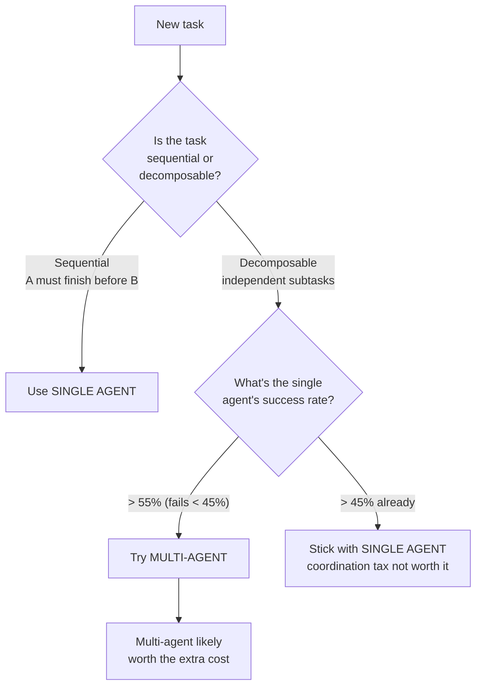
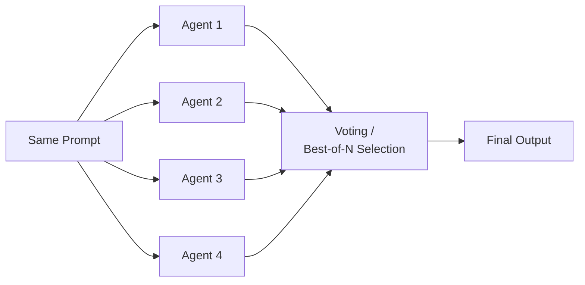
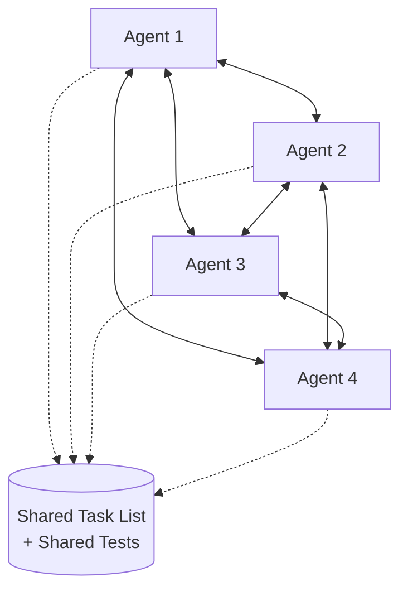
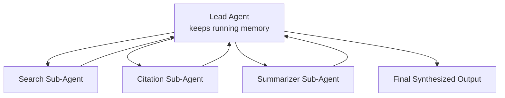
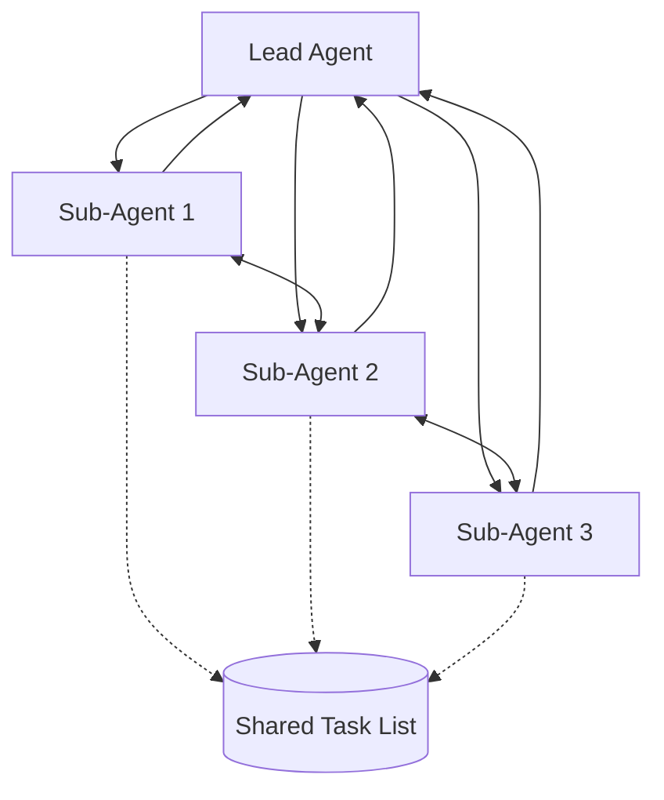

# Multi-Agent Systems — Complete Notes with Examples & Diagrams

*Compiled and expanded by Vansh Saini*

---

## 1. Core Concept: Why Multi-Agent?

2025 was widely called "the year of the single AI agent" — deep research tools, coding agents, and autonomous assistants all ran on **one** model instance doing everything.

**Key principle:** more tokens generally mean better performance. An agent that thinks longer, calls more tools, and iterates more produces better results. This is called **Test-Time Compute Scaling** — instead of making the model bigger (training-time scaling), you let it "think" more at the moment it answers.

### The problem with a single agent

- Every agent has a finite **context window** — even a 1M-token window fills up eventually.
- **Context rot:** as the context window fills, quality degrades. ChromaDB ran an experiment where a trivial word-repetition task started failing once the context was sufficiently full — not because the task got harder, but because the model's attention got diluted across too much irrelevant history.
- This creates a tension: you want more tokens (more reasoning, more tool calls) but more tokens cause rot and hurt performance.

**Example of context rot in practice:**

```
Turn 1-5:   Agent reads 5 files, plans a fix           → sharp, accurate
Turn 20-30: Agent has read 40 files, made 15 tool calls → starts contradicting
                                                            itself, forgets earlier
                                                            constraints, re-reads
                                                            files it already read
```

### The solution: Multi-Agent Systems

Split the work across multiple agents, each with its **own** context window.

| Benefit | What it means |
|---|---|
| Scales compute without rot | Each agent gets a fresh window — no single agent drowns in history |
| Parallelism | 10 research agents can investigate 10 topics simultaneously |
| Specialization | Like a human team, each agent has narrow tools + instructions, so its prompt stays focused and small |

---

## 2. When to Use Single vs Multi-Agent

This is the decision that trips up most people building agentic systems — jumping to multi-agent because it "sounds more advanced" usually backfires.



### Use a SINGLE AGENT when:

- **The task is sequential.** Task A must finish before Task B can start. Example: *read docs → make a plan → build the app.* You cannot plan before reading, so splitting this across agents just adds handoff overhead with no parallel benefit.
- **Cost is the priority.** Multi-agent cost is **super-linear**, not linear. 5 agents doesn't cost 5x — it costs *more* than 5x, because of the "coordination tax" (agents re-explaining context to each other, redundant tool calls, a lead agent synthesizing everything).
- **Google Research rule of thumb:** if a single agent already succeeds on the task >45% of the time, don't bother with multi-agent — the coordination cost outweighs the marginal gain.

### Use MULTI-AGENT when:

- **The task is decomposable** into independent, parallelizable subtasks. Example: "research all RAG solutions" → one agent researches Chroma, one Cohere, one LlamaIndex — none of them depend on each other's output.
- You're optimizing for **performance**, not cost.
- The single agent's success rate is **below 55%** (i.e., it's failing more than 45% of the time) — there's real room for multi-agent to help.

**Practical workflow:** always start with a single agent, measure its success rate, and *only* graduate to multi-agent once you've confirmed the task is decomposable and the single-agent ceiling is too low.

---

## 3. Four Architectures of Multi-Agent Systems

*(Based on a Google Research paper on multi-agent design patterns)*

### Architecture 1 — Independent (No Communication)



**What it is:** send the identical prompt to 5–10 fully isolated agents. They never talk to each other. At the end, pick the best output by voting or a scoring function.

**Use case:** generate 3–5 different UI mockups from the same spec, then pick the best one.

- ✅ Pros: trivially simple, zero coordination cost.
- ❌ Cons: only marginal quality gains, and Google's study found this pattern produces **17x more errors** than a single well-run agent — because there's no cross-checking or error correction between agents.

---

### Architecture 2 — Decentralized / Swarm (Peer-to-Peer)



**What it is:** every agent can talk to every other agent — no single "boss." Coordination happens through a shared **harness**: a shared task list and a shared test suite that all agents read/write to.

**Real example:** Anthropic reportedly used 16 agents in a swarm pattern to build a C compiler in ~2 weeks — roughly 100k lines of Rust, ~$20k in API cost, 99% accuracy on a benchmark suite, and the compiler could run DOOM. A human team doing the same thing would likely take months and cost well over $100k.

- ✅ Pros: conceptually simple to describe; best when the task is **explore-heavy** and needs wide breadth of investigation.
- ❌ Cons: maximum coordination tax. If Agent 3 discovers something important, it has to somehow propagate that to Agents 1, 2, and 4 — and building the harness that makes this work reliably is genuinely hard engineering.

---

### Architecture 3 — Centralized (Orchestrator / Lead)



**What it is:** one lead agent delegates narrow, well-defined tasks to specialized sub-agents (a search agent, a citation-checking agent, a code-writing agent, etc.). The lead keeps the *only* running memory of the whole task; sub-agents are stateless specialists that report back and then disappear.

**Real example:** Anthropic's own Multi-Agent Research System (used in Claude's research features) follows this pattern — a lead agent plans the research, spins up sub-agents to search different angles, then synthesizes their findings.

- ✅ Pros: **best pattern for error correction.** If a sub-agent hallucinates or makes a mistake, only the lead sees that output — it can verify, discard, or re-ask before the mistake ever spreads. This gives the lowest "error amplification" of all four patterns.
- ❌ Cons: more complex to build than Architecture 1 or 2; the orchestration logic (deciding what to delegate, when, and how to merge results) is non-trivial.

---

### Architecture 4 — Hybrid (Centralized + Peer Communication)



**What it is:** a lead agent still delegates work top-down, but sub-agents are *also* allowed to talk directly to each other through a shared task list — they don't have to relay everything through the lead like a game of telephone.

**Real example:** Claude Code's "Agent Teams" feature reportedly uses this hybrid pattern.

- ✅ Pros: gets centralized error correction (from the lead) **and** decentralized flexibility (peer-to-peer chatter) — sub-agents don't waste turns just passing messages up and down.
- ❌ Cons: the most complicated pattern to implement correctly, and it still carries a coordination tax — every peer message adds tokens to every agent's context, so it's not free.

---

### Quick comparison table

| Architecture | Communication | Error correction | Best for | Coordination cost |
|---|---|---|---|---|
| Independent | None | Poor (17x more errors) | Cheap best-of-N generation | Lowest |
| Decentralized / Swarm | All-to-all | Weak — errors can spread | Wide, explore-heavy tasks | Highest |
| Centralized / Orchestrator | Lead ↔ sub-agents only | Strong | Research, tasks needing synthesis | Medium |
| Hybrid | Lead ↔ subs + peer-to-peer | Strong + flexible | Complex, evolving tasks (e.g. coding) | Medium-High |

---

## 4. A Minimal Centralized Example (Java / Spring Boot style)

Since Architecture 3 (Centralized) gives the best error-correction-to-complexity ratio, here's a stripped-down sketch of how you'd model it in a Spring Boot service — useful as a mental model for something like AgentMesh's Root-Cause-Analyzer / Fix-Suggester / Verifier pipeline.

```java
public interface Agent {
    AgentResult execute(AgentTask task);
}

// A narrow, single-purpose sub-agent
public class SearchAgent implements Agent {
    @Override
    public AgentResult execute(AgentTask task) {
        // Calls a search tool, returns raw findings only —
        // no synthesis, no final answer. Stateless.
        List<String> findings = searchTool.query(task.getQuery());
        return new AgentResult(findings);
    }
}

// The lead agent — the only one holding running memory
public class LeadAgent {

    private final List<Agent> subAgents;
    private final ConversationMemory memory; // running state lives HERE only

    public FinalAnswer run(String userGoal) {
        List<AgentTask> subtasks = planSubtasks(userGoal); // decompose

        List<AgentResult> results = subtasks.stream()
            .map(task -> delegate(task))     // could be parallel via CompletableFuture
            .toList();

        // Lead verifies each result before merging — this is where
        // error correction happens; a bad sub-agent result gets
        // caught here instead of propagating further.
        List<AgentResult> verified = results.stream()
            .filter(this::passesVerification)
            .toList();

        memory.record(userGoal, verified);
        return synthesize(verified);
    }

    private AgentResult delegate(AgentTask task) {
        Agent agent = pickAgentFor(task); // e.g. SearchAgent, CitationAgent
        return agent.execute(task);
    }
}
```

The key design idea to take away: **sub-agents are stateless and narrow; the lead is the only place holding memory and making judgment calls.** That's precisely what keeps errors from compounding.

---

## 5. Limitations & Future Direction

1. **No single optimal architecture** — it genuinely depends on the task's decomposability, cost sensitivity, and error tolerance.
2. **The harness is the hard part.** The scaffolding around the agents (shared task lists, shared tests, verification logic) is highly use-case-specific, and there aren't established best practices yet — this is still an active research area, not a solved engineering problem.
3. **Heuristics like the "45% rule" are temporary.** As base models get smarter and cheaper, the cost/benefit line between single- and multi-agent will keep shifting — treat these numbers as a snapshot of today, not a law.

---

## Sources / Further Reading

- Google Research paper on multi-agent architecture patterns
- Anthropic's Multi-Agent Research System writeup
- ChromaDB's context-rot research
- Claude Code "Agent Teams" documentation
